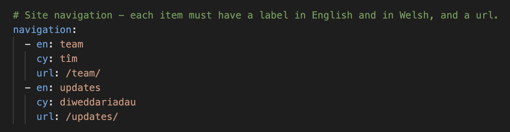

# Add a new section to your site

Decide on the name of your new section.

Then create a new folder in `/en`, give it the name of the section.

And create a new folder in `/cy`, give it the same name as the first new folder you created.

Create a new file in each folder. Name it `index.md`.

You should have a folder structure that looks like this.

```
project-site-repo
└───cy
│   │   index.md
│   │   ...
│   └───new-section
│       │   index.md
└───en
│   │   index.md
│   │   ...
│   └───new-section
│       │   index.md
```

You can now add content to these folders.

This new section and the content will be available at `<your-site-url>/en/new-section` or `<your-site-url>/cy/new-section`.

### Add new section to navigation

If you want to add the new section to the site navigation you can update the `navigation` option in `_config.yml`.

By default it has two items set up: the team section and the updates section.



You can add new navigation items or update existing ones there.

An item consists of 3 bits. The English name, in `en`. The Welsh name, in `cy`. And the url, in `url`. For example:

```
- en: new section
  cy: adran newydd
  url: /new-section/
```

Make sure the indents/tabs line up with the existing items.

You should now have a new item in the navigation.

