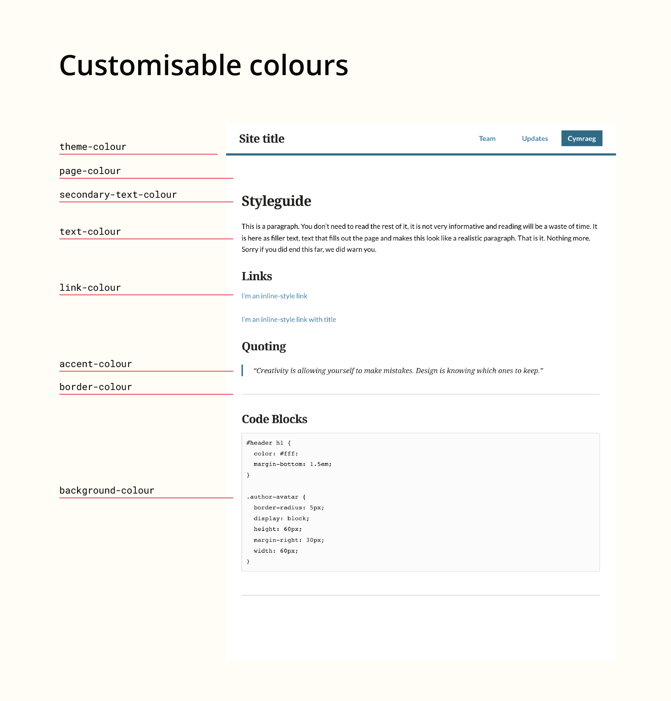
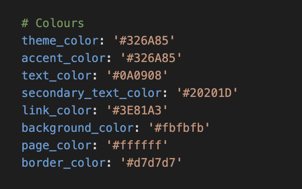

# Customise the colours

Some of the colours of the template project site are customisable.

The default values are set in `_config.yml`. You can update these to change the lokk and feel of your site.

The colours you have the option to change are:

* theme-colour
* page-colour
* text-colour
* secondary-text-colour
* link-colour
* accent-colour
* border-colour
* background-colour

This image shows you how each colour is used.

Edit them in `_config.yml`. Each colour must be set to a 6 digit hex colour prepended with a `#`.

You can use tools such as [coolors](https://coolors.co/?ref=5e9c780818a3f41357243747) to find nice colours and their hex values.

Don't forget to [check the contrast of your colours](https://webaim.org/resources/contrastchecker/) passes the WCAG recommendation.
