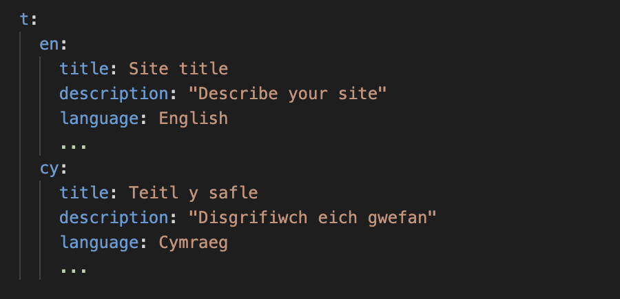

# Change the site name

The site name is a configurable option.

You can change it in the `_config.yml` file.

This is a bilingual template. We have set it up so that it can be used by English and Welsh speakers. Therefore, you will need to change the name in 2 place - 1 for English pages and 1 for Welsh pages.

In `_config.yml` there is a data structure that contains both English and Welsh versions of key words and phrases. It will look like this

Add the English name as the value of `t:en:title`.
And the Welsh name as the value of `t:cy:title`.

Whilst you are here you can also change the site description. Replace `Describe your site` and `Disgrifiwch eich gwefan` with your description.
